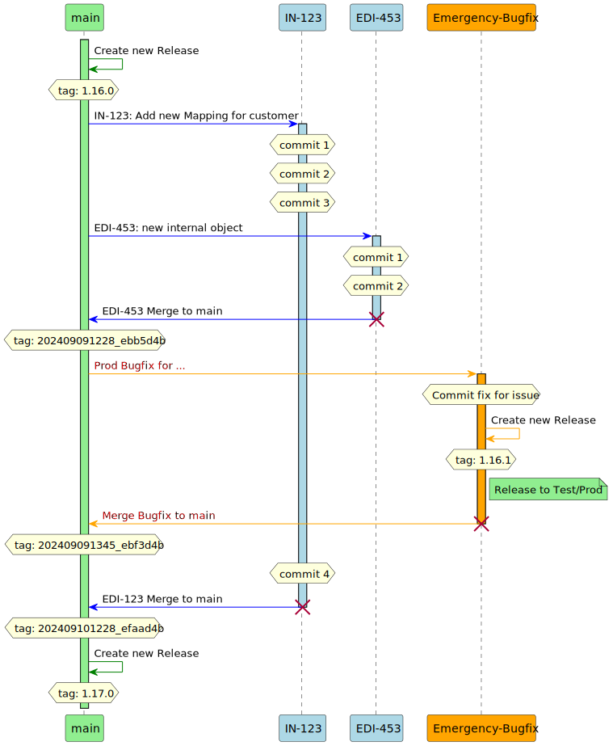

[#git-workflow]
= Git Workflow

Da die einzelnen Projekte eher klein sind, und auch oft nicht meherere Personen am gleichen Projekt arbeiten müssen, wird der Git Workflow einfach gehalten. Wir gehen davon aus, dass es eher selten ist, das Bugfixes und neue Feature sich in die Quere kommen.

Der `main`-Branch beinhaltet den aktuellen Code, der auf Test und Produktion deployed wird.

Folgende 2 Use Cases werden dabei berücksichtigt:

. Neues Feature implementieren (Feature oder Change)
. Production Bugfix (emergency) implementieren

Für alle Änderungen, egal ob neues Feature oder Bugfix, dient immer der `main`-Branch als Basis um einen entsprechenden Feature- bzw. Bugfix-Branch zu erstellen.

[.thumb]

== Feature Development

Die Features werden auf dem Feature Branch entwickelt.

NOTE: Feature Branches sollten immer die entsprechende Ticket ID aus JIRA beinhalten.

Alle Commits werden bis zum entsprechenden Pull-Request und Code Review auf diesen Branch gemacht. Ist das Feature bereit fürs Integration-Testing, wird es auf den `main`-Branch gemerged.

NOTE: Beim Mergen nach `main` immer *Squash Commit*  verwenden, so dass es nur einen Commit für das gesamte Feature gibt.

NOTE: Jeder Commit auf dem `main`-Branch löst automatisch einen Build mit anschliessendem Deployment in die Test Umgebung aus.

Treten beim Integration-Testing noch Fehler auf, werden diese entsprechend wieder auf dem Feature Branch gelöst und danach nach `main` gemerged. Dabei werden entsprechend neue Versionen generiert und deployed.

Wurde das Intergation Testing erfolgreich abgeschlossen, wird auf dem `main`-Branch ein neues Release erstellt. Auf deisem Release werden auch entsprechende Release Notes (Changelog) hinzugefügt, um die Änderungen zu Tracken. Ein Release kann dabei natürlich auch mehrere Changes/Features enthalten.

Der neu erstellte Release wird dann nach Prod deployed.

== Bugfix Deployment

Um zu verhindern, dass Feature deployments einen Einfluss auf Bugfixes haben, werden die Brnaches Bugfixes immer auf Basis des letzten Release-Tags erstellt.

Ist der Bugfix bereit fürs Integration Testing, wird auf dem *Bugfix*-Branch ein neuer Tag erstellt, der zu einem neuen Build führt und nach Test deployed werden kann.

Nach erfolgreichen Integration-Testing wird auch hier ein Release-Tag erstellt und mit Release Notes versehen, der anschliessen nach Prod deployed wird.

Erst jetzt zum Abschluss werden diese Changes auf den `main`-Branch gemerged.

